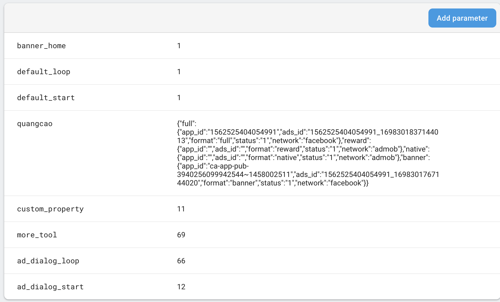

<p align="center"></p>

Hướng dẫn sử dụng:
=====

- Cấu hình trong firebase remote config
> Config key mặc định trong thằng FIREBASE:
````
  quangcao
  more_tool
  ad_dialog_loop
  ad_dialog_start
````
- Trong thằng quảng cáo mình cần chọn cấu hình JSON cho nó: Ví dụ cho Admob và Facebook test
>Admob
````
{
  "full": {
    "app_id": "ca-app-pub-3940256099942544~1458002511",
    "ads_id": "ca-app-pub-3940256099942544/4411468910",
    "format": "full",
    "status": "1",
    "network": "admob"
  },
  "reward": {
    "app_id": "",
    "ads_id": "",
    "format": "reward",
    "status": "0",
    "network": "admob"
  },
  "native": {
    "app_id": "",
    "ads_id": "",
    "format": "native",
    "status": "0",
    "network": "admob"
  },
  "banner": {
    "app_id": "ca-app-pub-3940256099942544~1458002511",
    "ads_id": "ca-app-pub-3940256099942544/2934735716",
    "format": "banner",
    "status": "1",
    "network": "admob"
  }
}
````
> Facebook
````
{
  "full": {
    "app_id": "1562525404054991",
    "ads_id": "1562525404054991_1698301837144013",
    "format": "full",
    "status": "1",
    "network": "facebook"
  },
  "reward": {
    "app_id": "",
    "ads_id": "",
    "format": "reward",
    "status": "0",
    "network": "facebook"
  },
  "native": {
    "app_id": "",
    "ads_id": "",
    "format": "native",
    "status": "0",
    "network": "facebook"
  },
  "banner": {
    "app_id": "1562525404054991",
    "ads_id": "1562525404054991_1698301767144020",
    "format": "banner",
    "status": "1",
    "network": "facebook"
  }
}
````
> Demo firebase config. Chúng ta có thể tạo một số thuộc tính khác cần thiết: ví dụ : banner_home
<p align="center"></p>
