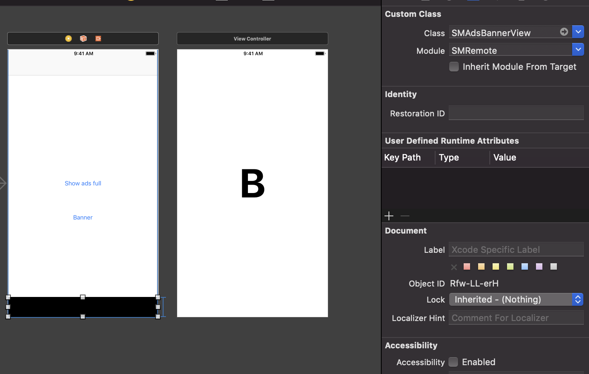
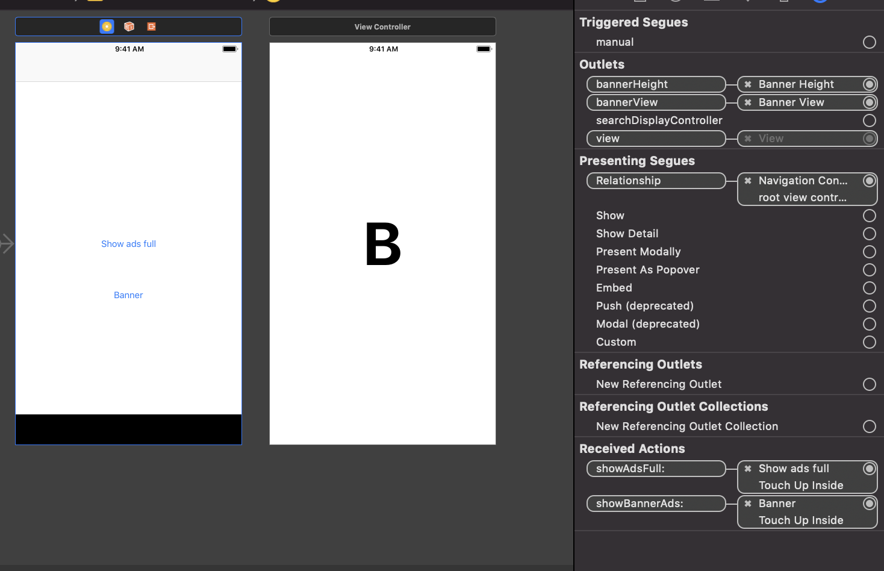
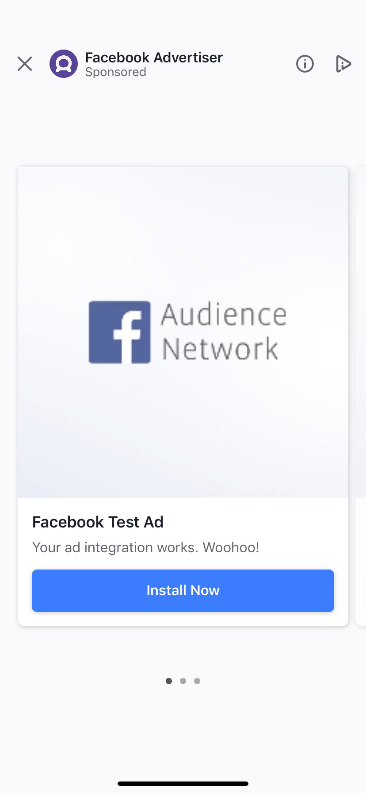
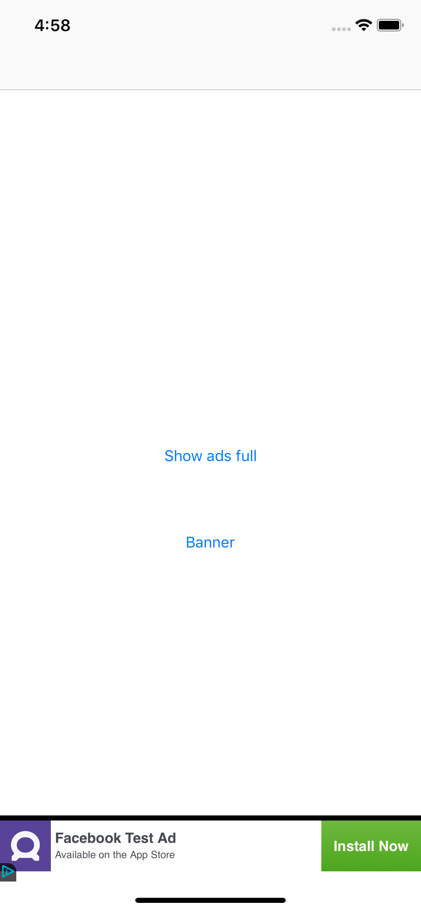

<p align="center"></p>

Bước 1: FIREBASE
=====

- Cấu hình trong firebase remote config
> Config key mặc định trong thằng FIREBASE:
````
  quangcao
  more_tool
  ad_dialog_loop
  ad_dialog_start
````
- Mình có thể thêm các config khác (AM quy định). Với các value theo họ yêu cầu
````
dong_dep_trai
dong_khoai_to
````

- Trong thằng quảng cáo mình cần chọn cấu hình JSON cho nó: Ví dụ cho Admob và Facebook test
>Admob
````
{
  "full": {
    "app_id": "ca-app-pub-3940256099942544~1458002511",
    "ads_id": "ca-app-pub-3940256099942544/4411468910",
    "format": "full",
    "status": "1",
    "network": "admob"
  },
  "reward": {
    "app_id": "",
    "ads_id": "",
    "format": "reward",
    "status": "0",
    "network": "admob"
  },
  "native": {
    "app_id": "",
    "ads_id": "",
    "format": "native",
    "status": "0",
    "network": "admob"
  },
  "banner": {
    "app_id": "ca-app-pub-3940256099942544~1458002511",
    "ads_id": "ca-app-pub-3940256099942544/2934735716",
    "format": "banner",
    "status": "1",
    "network": "admob"
  }
}
````
> Facebook
````
{
  "full": {
    "app_id": "1562525404054991",
    "ads_id": "1562525404054991_1698301837144013",
    "format": "full",
    "status": "1",
    "network": "facebook"
  },
  "reward": {
    "app_id": "",
    "ads_id": "",
    "format": "reward",
    "status": "0",
    "network": "facebook"
  },
  "native": {
    "app_id": "",
    "ads_id": "",
    "format": "native",
    "status": "0",
    "network": "facebook"
  },
  "banner": {
    "app_id": "1562525404054991",
    "ads_id": "1562525404054991_1698301767144020",
    "format": "banner",
    "status": "1",
    "network": "facebook"
  }
}
````
> Demo firebase config. Chúng ta có thể tạo một số thuộc tính khác cần thiết: ví dụ : banner_home
<p align="center"></p>

Bước 2: PROJECT
=====
- Review về SMConfig chút: không dùng property default_loop và default_start cũng chẳng sao cả!
````
import Foundation
open class SMConfig : NSObject {

    @objc open var ad_dialog_start = 1
    @objc open var ad_dialog_loop = 1
    @objc open var more_tool = 1

    @objc open var default_start = 1
    @objc open var default_loop = 2

}
````
- Tạo 1 class kế thừa từ thằng SMConfig kia theo demo.
````
import Foundation
open class Dev : SMConfig {

    @objc var custom_property = 1
    @objc var banner_home = 1
}

````
Thế là bạn đã hoàn thành các bước config rồi.

Bước 3: Thần code trong 1 nốt nhạc
====
> Cài đặt thư viện:
````
pod 'SMRemote'
````
> Import nó trong header. hoặc trong class tùy chỉnh
````
import SMRemote

````
> Trong Appdelegate
````
func application(_ application: UIApplication, didFinishLaunchingWithOptions launchOptions: [UIApplicationLaunchOptionsKey: Any]?) -> Bool {
      // Override point for customization after application launch.
      FirebaseApp.configure()
      GADMobileAds.sharedInstance().start(completionHandler: nil)
      return true
  }
````

> Mình cần load config: Thường thì mình sẽ gọi ở splash fake
````
func loadConfig() {
       SMRemote.sharedInstance.load(smConfig: Dev()) {
           print("Tải thành công config từ remote")
       }
   }
````


> Hiện quảng cáo full:
````
@IBAction func showAdsFull(_ sender: Any) {
    //Gọi full với start loop
    SMAdsManager.shared.showFull(controller: self, start: #keyPath(Dev.default_start), loop: #keyPath(Dev.default_loop)) { (success) in
        print("Action tiếp theo sau khi hiện ads full. Ở đây ví dụ sang màn hình tiếp theo 'B'")
        let vc = self.storyboard?.instantiateViewController(withIdentifier: "B")
        self.navigationController?.pushViewController(vc!, animated: true)
    }
}
````
> Quảng cáo banner: Mình cần có cái outlet của banner view: (Để nó trong controller)
````
@IBOutlet weak var bannerHeight: NSLayoutConstraint!
@IBOutlet weak var bannerView: SMAdsBannerView!
````
> Cách thực hiện trên storyboard:
1. Kéo 1 cái view vào controller
2. Đổi class UIView của cái view vừa kéo thành SMAdsBannerView
<p align="center"></p>
3. Kéo @IBOutlet vào ViewController
<p align="center"></p>

> Gọi quảng cáo:
````
@IBAction func showBannerAds(_ sender: Any) {
    //Hàm gọi quảng cáo
    SMAdsManager.shared.showBannerAds(present: self, bannerView: self.bannerView, bannerHeight: self.bannerHeight, keyConfig: #keyPath(Dev.banner_home))
}
````
Kết quả
====
<p align="center"></p>
<p align="center"></p>
